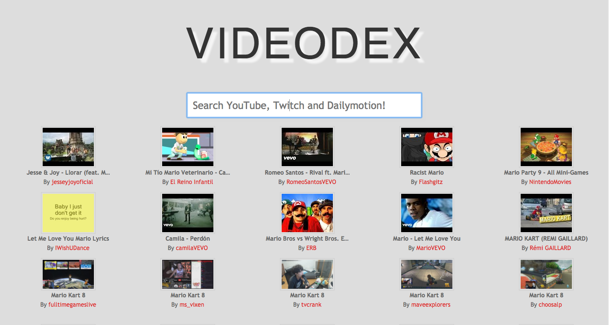
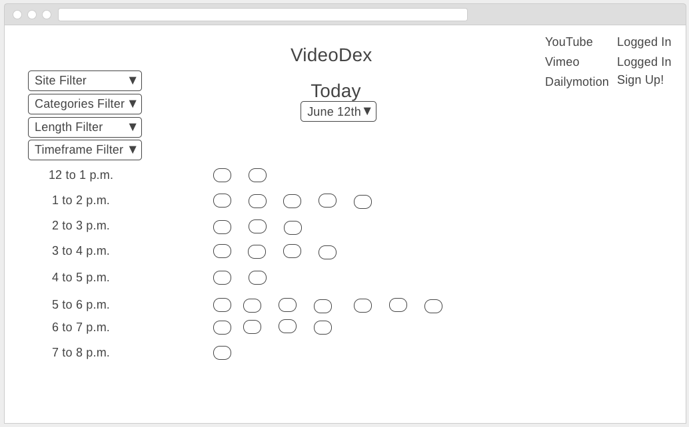
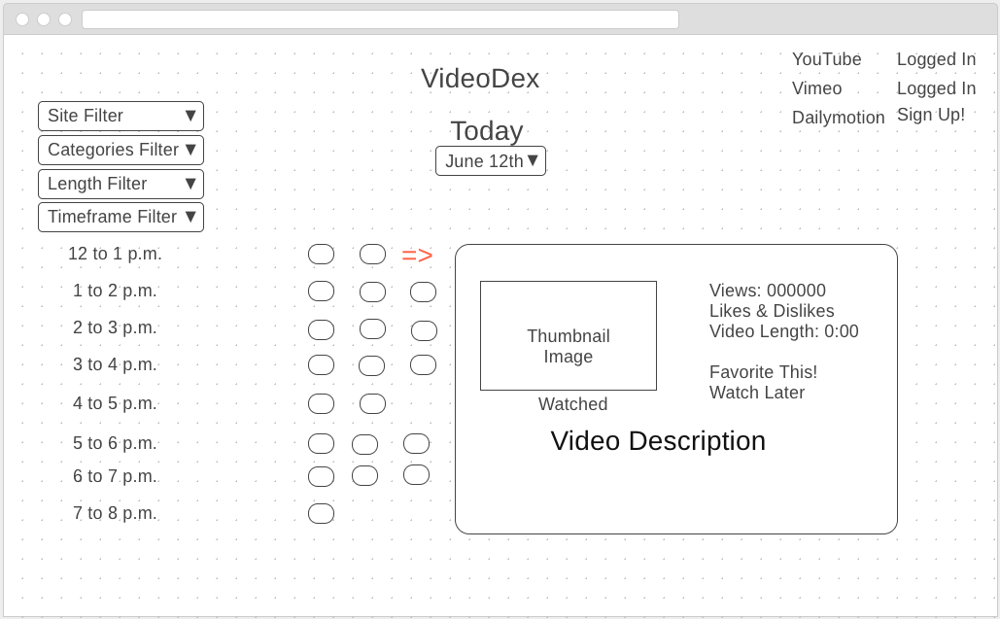

# VideoDex
> A browser website providing video content from YouTube, Twitch and Dailymotion.

	https://yamilburgos.github.io/VideoDex

## Tech Stack
* HTML & CSS
* JavaScript
* Node.js
* React.js
* [YouTube's Data API](https://developers.google.com/youtube/v3/)
* [Dailymotion's Data API](https://developer.dailymotion.com/api)
* [Twitch's API](https://dev.twitch.tv/)

## Wireframes

## User Stories
* As a user, I like to only see videos from channels that I have already subscribed to/favorited.
* As a user, I like to see all videos in the timeslot view on a given day (Today and previous days).
* As a user, I like to be able to filter out certain sites from appearing on my timeslot view.
* As a user, I like to be able to filter videos out of the timeslot view via:
	* Timeframe (6 to 9am, 1pm, etc.)
	* Channel (Either by dropdown or checkbox)
	* Day (Monday, Tuesday, etc.)
	* Categories (Gaming, Politics, Humor, etc.)
* As a user, I like to see basic information from a Video like:
	* Subscriber Count
	* Video's Likes & Dislikes (or favorites)
	* Length of Video
	* Thumbnail Image
	* Video Description
* As a user, I like to make the site mobile friendly & cross browser via bootstrap.

## Meta
[Yamil Burgos](https://github.com/yamilburgos/) – yamil.burgos1293@gmail.com

## Contributing
1. Fork it (<https://github.com/yamilburgos/VideoDex/fork>)
2. Create your feature branch (`git checkout -b feature/fooBar`)
3. Commit your changes (`git commit -am 'Add some fooBar'`)
4. Push to the branch (`git push origin feature/fooBar`)
5. Create a new Pull Request
