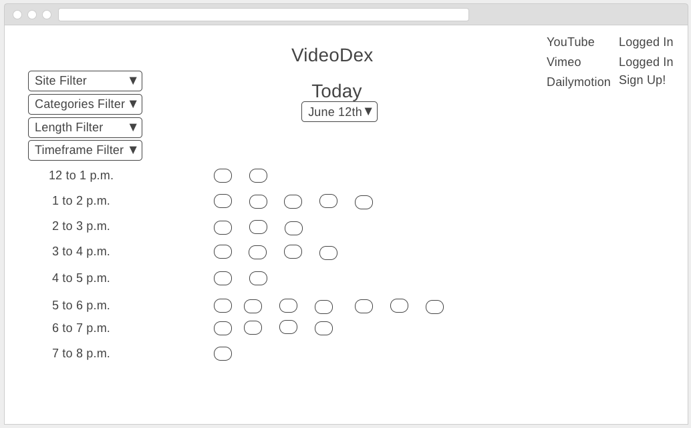
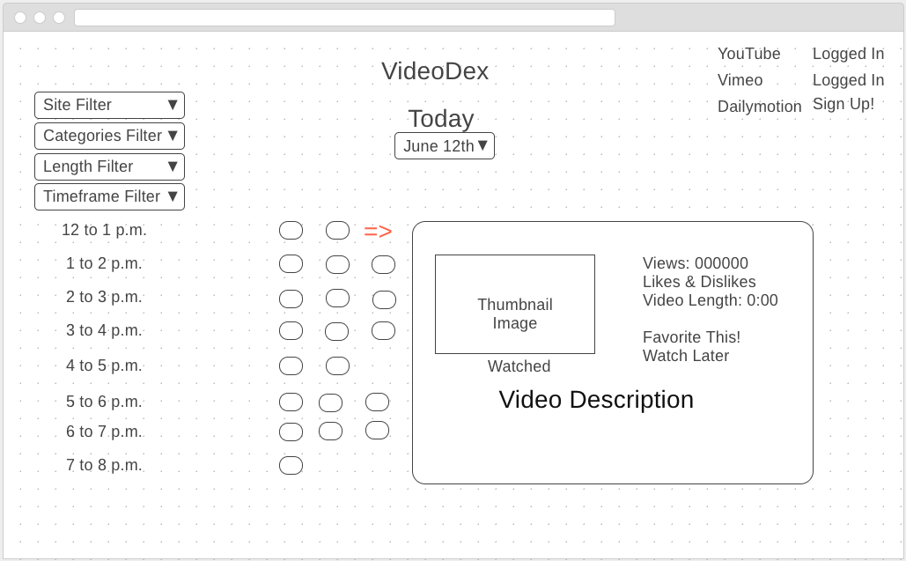

# Project 4 Proposal

### Project Name: VideoDex

VideoDex provides a simplified timeline view for all video content posted on YouTube, Vimeo and Dailymotion via a timeslot fashion. Meaning a user subscribed to one or all three of these sites have one place to get all of their video content on a given day. 

### Tech Stack
* HTML, CSS & JavaScript
* Postgres
* Node.js
* Express
* React
* Electron
* Bootstrap
* YouTube's Data API
* Dailymotion's Data API
* Vimeo's API

### Wireframes

### User Stories
* As a user, I like to only see videos from channels that I have already subscribed to/favorited.
* As a user, I like to see all videos in the timeslot view on a given day (Today and previous days).
* As a user, I like to be able to filter out certain sites from appearing on my timeslot view.
* As a user, I like to be able to filter videos out of the timeslot view via:
	* Timeframe (6 to 9am, 1pm, etc.)
	* Channel (Either by dropdown or checkbox)
	* Day (Monday, Tuesday, etc.)
	* Categories (Gaming, Politics, Humor, etc.)
* As a user, I like to see basic information from a Video like:
	* Subscriber Count
	* Video's Likes & Dislikes (or favorites)
	* Length of Video
	* Thumbnail Image
	* Video Description
* As a user, I like to make the site mobile friendly & cross browser via bootstrap.

### Post MVP
* Add ability to login for all three sites (or just one or two) in order for any user to customize their results.
* Provide the ability to share your timeslot view with other users.
* Get recommendations for similar content on all 3 sites.
* Get notifications for new videos that I am interested in.
* Get real-time updates for videos newly uploaded or removed.

### Project Links:
https://developer.vimeo.com/
https://developer.dailymotion.com/api
https://developers.google.com/youtube/v3/